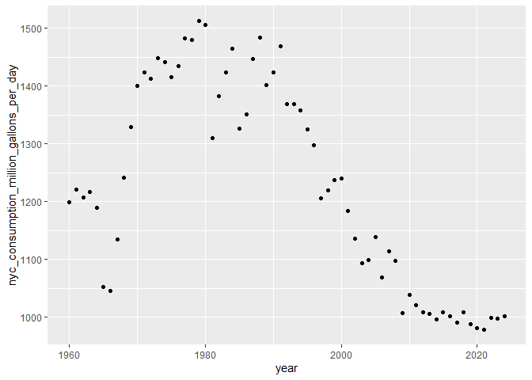

reading_data_from_the_web
================
Ruihan Ding
2025-10-21

Import NSDUH data

``` r
url = "https://samhda.s3-us-gov-west-1.amazonaws.com/s3fs-public/field-uploads/2k15StateFiles/NSDUHsaeShortTermCHG2015.htm"

drug_use = read_html(url)
```

This is an “easy” case

``` r
nsduh_df = 
  drug_use |> 
  html_table() |> 
  first() |>  # = nth(1)
  slice(-1) # remove the first row
```

Slightly harder case

``` r
url = "https://www.imdb.com/list/ls070150896/"

sw_html = read_html(url)
```

Now pull out elements of the html that I care about

``` r
title_vec = 
  sw_html |> 
  html_elements(".ipc-title-link-wrapper .ipc-title__text--reduced") |> 
  html_text()

metascore_vec = 
  sw_html |> 
  html_elements(".metacritic-score-box") |> 
  html_text()

runtime_vec = 
  sw_html |> 
  html_elements(".dli-title-metadata-item:nth-child(2)") |> 
  html_text()

sw_df = 
  tibble(
    title = title_vec,
    metascore = metascore_vec,
    runtime = runtime_vec
  )
```

# API

Get data using an API

``` r
nyc_water_df = 
  GET("https://data.cityofnewyork.us/resource/ia2d-e54m.csv") |> 
  content("parsed")
```

    ## Rows: 65 Columns: 4
    ## ── Column specification ────────────────────────────────────────────────────────
    ## Delimiter: ","
    ## dbl (4): year, new_york_city_population, nyc_consumption_million_gallons_per...
    ## 
    ## ℹ Use `spec()` to retrieve the full column specification for this data.
    ## ℹ Specify the column types or set `show_col_types = FALSE` to quiet this message.

``` r
nyc_water_df |> 
  ggplot(aes(x = year, y = nyc_consumption_million_gallons_per_day)) +
  geom_point()
```

<!-- -->

Access BRFSS

``` r
brfss_df = 
  GET(
    "https://chronicdata.cdc.gov/api/v3/views/acme-vg9e/query.csv",
    query = list("app_token" = "hBym4QiQDFerUXPrQwcA4VeP7")
    ) |> 
  content("parsed")
```

Look at Pokemon

``` r
poke = 
  GET("https://pokeapi.co/api/v2/pokemon/1") |> 
  content()

poke[[2]]
```

    ## [1] 64
