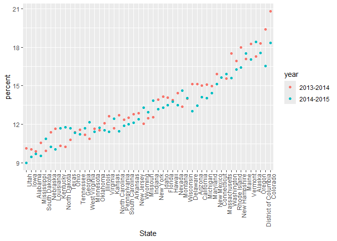
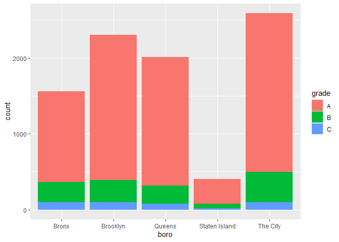
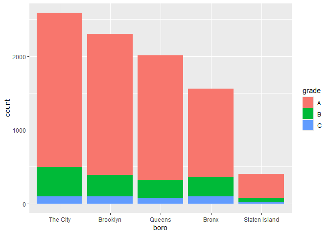

strings_and_factors
================
Ruihan Ding
2025-10-21

## Mostly use string vectors

``` r
string_vec = c("my", "name", "is", "Arwen")

str_detect(string_vec, "Arwen")
```

    ## [1] FALSE FALSE FALSE  TRUE

``` r
str_detect(string_vec, "e")
```

    ## [1] FALSE  TRUE FALSE  TRUE

``` r
str_replace(string_vec, "Arwen", "")
```

    ## [1] "my"   "name" "is"   ""

``` r
str_remove(string_vec, "e")
```

    ## [1] "my"   "nam"  "is"   "Arwn"

``` r
string_vec = c(
  "i think we all rule for participating",
  "i think i have been caught",
  "i think this will be quite fun actually",
  "it will be fun, i think"
  )

str_detect(string_vec, "^i think")  # ^ means start of the string
```

    ## [1]  TRUE  TRUE  TRUE FALSE

``` r
str_detect(string_vec, "i think$")  # $ means end of the string
```

    ## [1] FALSE FALSE FALSE  TRUE

``` r
str_remove(string_vec, "i think$")
```

    ## [1] "i think we all rule for participating"  
    ## [2] "i think i have been caught"             
    ## [3] "i think this will be quite fun actually"
    ## [4] "it will be fun, "

``` r
string_vec = c(
  "Time for a Pumpkin Spice Latte!",
  "went to the #pumpkinpatch last weekend",
  "Pumpkin Pie is obviously the best pie",
  "SMASHING PUMPKINS -- LIVE IN CONCERT!!"
  )

str_detect(string_vec,"[Pp]umpkin")
```

    ## [1]  TRUE  TRUE  TRUE FALSE

Let’s get a bit more complicated

``` r
string_vec = c(
  '7th inning stretch',
  '1st half soon to begin. Texas won the toss.',
  'she is 5 feet 4 inches tall',
  '3AM - cant sleep :('
  )

str_detect(string_vec, "^[0-9][a-zA-Z]")
```

    ## [1]  TRUE  TRUE FALSE  TRUE

``` r
string_vec = c(
  'Its 7:11 in the evening',
  'want to go to 7-11?',
  'my flight is AA711',
  'NetBios: scanning ip 203.167.114.66'
  )

str_detect(string_vec, "7\\.1")
```

    ## [1] FALSE FALSE FALSE  TRUE

``` r
# . means anything (this is a special character),
# \ means the thing after is not a special character, need \\
```

## Factors

``` r
vec_sex = factor(c("male", "male", "female", "female"))

vec_sex = fct_inorder(vec_sex)
```

## Revisit NSDUH

``` r
url = "https://samhda.s3-us-gov-west-1.amazonaws.com/s3fs-public/field-uploads/2k15StateFiles/NSDUHsaeShortTermCHG2015.htm"

drug_use = read_html(url)
nsduh_df = 
  drug_use |> 
  html_table() |> 
  first() |>
  slice(-1)
```

Now do the tidying

``` r
marj_df =
  nsduh_df |> 
  select(-contains("P value")) |> 
  pivot_longer(
    -State,
    names_to = "age_year",
    values_to = "percent"
  ) |> 
  separate(age_year, into = c("age", "year"), sep = "\\(") |> 
  mutate(
    year = str_remove(year, "\\)"),
    percent = str_remove(percent, "[a-c]$"),
    percent = as.numeric(percent)
  ) |> 
  filter(
    !(State %in% c("Total U.S.", "Northeast", "Midwest", "South", "West"))
  )
# when filtering for items in a collection, use %in%
```

Let’s make a plot

``` r
marj_df |> 
  filter(age == "12-17") |> 
  mutate(State = fct_reorder(State, percent)) |> 
  ggplot(aes(x = State, y = percent, color = year)) +
  geom_point() +
  theme(axis.text.x = element_text(angle = 90, hjust = 1))
```

<!-- -->

## Restaurant Inspections

``` r
data("rest_inspec")
```

``` r
rest_inspec |> 
  group_by(boro, grade) |> 
  summarize(n = n()) |> 
  pivot_wider(
    names_from = grade,
    values_from = n
  )
```

    ## `summarise()` has grouped output by 'boro'. You can override using the
    ## `.groups` argument.

    ## # A tibble: 6 × 9
    ## # Groups:   boro [6]
    ##   boro              A     B     C  `NA`     N     P     Z     G
    ##   <chr>         <int> <int> <int> <int> <int> <int> <int> <int>
    ## 1 0                33     9     6    67    NA    NA    NA    NA
    ## 2 Bronx         14071  2611   976 17190   161   236   605    NA
    ## 3 Brooklyn      38896  6423  2194 49825   345   782  1168     2
    ## 4 Manhattan     61675  9107  3600 76581   591   924  1816     3
    ## 5 Queens        36258  5526  1996 44136   350   604  1287    NA
    ## 6 Staten Island  5410   855   248  6315    71    61   116    NA

uodate the dataset

``` r
rest_inspec = 
  rest_inspec |> 
  filter(grade %in% c("A", "B", "C"),
         boro != 0)
```

Look for pizza places

``` r
rest_inspec |> 
  filter(str_detect(dba, "[Pp][Ii][Zz][Zz][Aa]")) |> 
  group_by(boro, grade) |> 
  summarize(n = n()) |> 
  pivot_wider(
    names_from = grade,
    values_from = n
  )
```

    ## `summarise()` has grouped output by 'boro'. You can override using the
    ## `.groups` argument.

    ## # A tibble: 5 × 4
    ## # Groups:   boro [5]
    ##   boro              A     B     C
    ##   <chr>         <int> <int> <int>
    ## 1 Bronx          1201   261    98
    ## 2 Brooklyn       1919   291    95
    ## 3 Manhattan      2091   400    96
    ## 4 Queens         1695   239    78
    ## 5 Staten Island   328    60    15

Let’s make a plot

``` r
rest_inspec |> 
  filter(str_detect(dba, "[Pp][Ii][Zz][Zz][Aa]")) |> 
  mutate(
    boro = fct_infreq(boro),
    boro = str_replace(boro, "Manhattan", "The City")) |>  
    # converted it back to string
  ggplot(aes(x = boro, fill = grade)) +
  geom_bar()
```

<!-- -->

The previous one doesn’t work as intended, but the below one does.

``` r
rest_inspec |> 
  filter(str_detect(dba, "[Pp][Ii][Zz][Zz][Aa]")) |> 
  mutate(
    boro = fct_infreq(boro),
    boro = fct_recode(boro, "The City" = "Manhattan")) |>  
  ggplot(aes(x = boro, fill = grade)) +
  geom_bar()
```

<!-- -->
